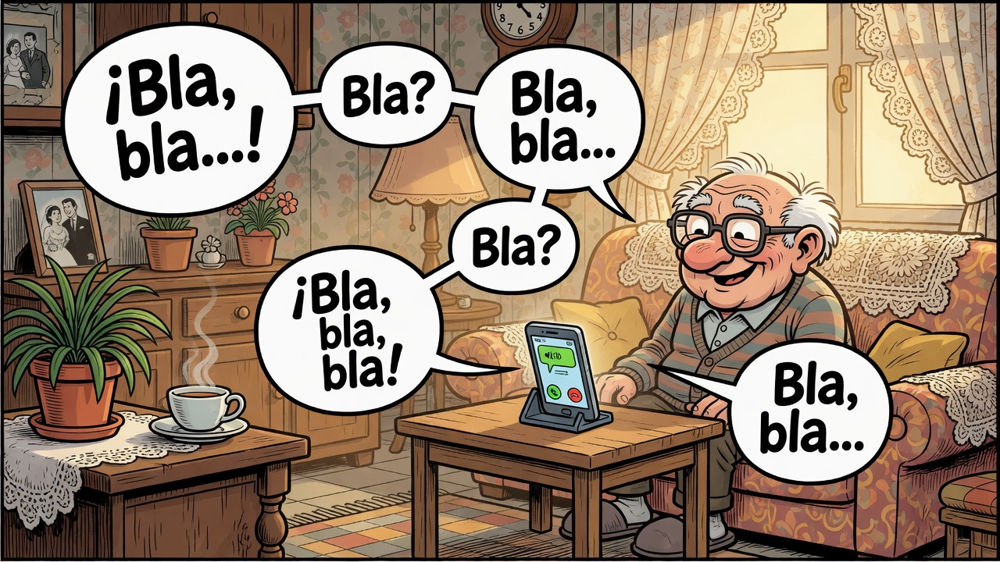
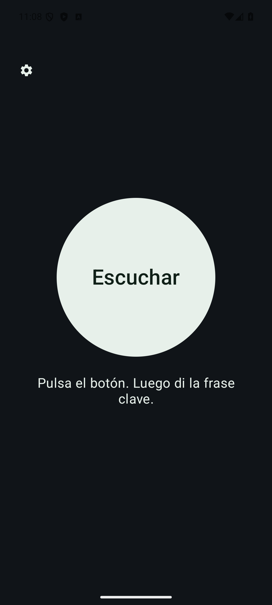

[Español](README.md) · [English](README.EN.md) · [Français](README.FR.md)

<p>
  <a href="https://github.com/antonio-castellon/Grok_Android/releases/latest"></a>
  <a href="LICENSE"></a>
  
  
</p>



# Grok Stimme

Ein Telefon bleibt ein kleiner Bildschirm, auch mit sehr großer Schrift. Für einen Menschen, der schlecht sieht, genügt es, den Mikrofonknopf zu suchen, ihn mit dem Finger zu treffen und sich nicht in den Menüs zu verlieren, und das Gerät ist im Alltag fast unbrauchbar. Grok hört zu, wenn man diesen Knopf erreicht. Das Erreichen ist das Schwere.

Grok Stimme führt das weiter, was [Grok Assistant](https://github.com/antonio-castellon/Grok_Assistant) am Computer ist und [Grok Pi Assistance](https://github.com/antonio-castellon/Grok_Pi_Assistance) auf dem Raspberry Pi. In meinem Fall ist die Person mein Vater. Ich wollte, dass er Grok als Gesprächspartner haben kann, ohne lesen zu müssen.

Der Bildschirm ist absichtlich fast leer. Ein großer Knopf in der Mitte öffnet das Mikrofon wieder. Fragen, weiterreden und aufhören geht mit der Stimme, so natürlich, wie ich es innerhalb dessen lassen konnte, was Android erlaubt. Die Einstellungen liegen in einem kleinen Symbol oben links, etwas unter der Leiste, damit man es nicht aus Versehen trifft, wenn man die Benachrichtigungen herunterzieht.

Das Mikrofon soll so lange offen bleiben, wie das System es zulässt. Was im Haus zu hören ist, verlässt das Telefon nicht. Nur ein Satz, der an Grok gerichtet ist, geht in die Cloud. Man beginnt mit „hola grok“ — oder mit „hey grok“, wenn einem das lieber ist — und schließt, wann man will, mit einem „gracias“ oder einem kurzen Abschied. Eine Weile Stille schließt das Gespräch ebenfalls.

Beim ersten Öffnen wird die Stimme nicht aufgenommen und es gibt keinen Stimmabdruck. Der Satz ist schon geschrieben, in Phonemen, es ist keine Aufnahme der Person. Trotzdem muss man ihn an einem echten Mikrofon prüfen: manche schneiden den Wortanfang ab, und dann wird der Satz nie gehört.

Andere Anwendungen hören zu, lesen Nachrichten oder telefonieren. Diese hier will ihren Platz nicht einnehmen. Sie ist dafür da, dass ein älterer Mensch nur einen Knopf treffen muss und das, was er fragen oder erzählen will, einfach sagen kann. Später, wenn es nötig wird, lassen sich in den Einstellungen das Vorlesen von WhatsApp und ein Anruf an jemanden aus dem Adressbuch einschalten. Eine neue Nachricht wird nie von selbst vorgelesen. Die Stimme fragt, und der Text kommt erst nach einem Ja. Man kann auch die letzten Nachrichten einer Person verlangen, mit dem Namen dieses Gesprächs. Telegram habe ich bisher nicht hingekriegt.

Die offizielle Grok-App teilt ihre Anmeldung nicht, auch wenn sie schon auf dem Telefon liegt. Es gibt keinen Weg, das Konto zu verbinden, ohne etwas zu schreiben. Den API-Schlüssel fügt man einmal ein, von [console.x.ai](https://console.x.ai), und er bleibt auf dem Telefon. Wenn das Guthaben alle ist, sagt die Stimme, dass sie mehr Treibstoff braucht.

Android schließt manchmal, was eine Weile zugehört hat. Wenn es den Prozess beendet, kommt das Mikrofon nicht von selbst zurück: die App öffnen und den Knopf drücken. Wenn die App noch da ist, das Mikrofon aber nicht mehr hört, sagt sie ein paar Mal Bescheid, mit einigen Minuten Abstand, falls beim ersten Mal niemand in der Nähe war. Wie oft, und in welchem Abstand, stellt man in den Einstellungen ein.

Die App spricht Spanisch, Englisch, Französisch, Deutsch und Italienisch.

<p align="center">
  
</p>

## Was das Telefon braucht

Android 9 oder neuer, ein gewöhnliches ARM-Telefon (64 oder 32 Bit). Es braucht ein Mikrofon, und beim ersten Mal Netz: ein kleines Modell für den Satz wird geladen, und jedes Gespräch mit Grok geht ins Internet. Die App ist etwa 45 MB, das Modell ein wenig mehr. Die offizielle Grok-App ist nicht nötig. Ein Schlüssel von [console.x.ai](https://console.x.ai) schon.

## So wird sie eingerichtet

1. Lade das APK der [Version 1.0.0](https://github.com/antonio-castellon/Grok_Android/releases/tag/v1.0.0).
2. Erlaube auf dem Telefon die Installation aus dieser Quelle und öffne die Datei.
3. Öffne Grok Stimme und tippe das kleine Symbol oben links.
4. Füge den Schlüssel ein. Sprache oder Satz kannst du ändern. Voreingestellt ist „hola grok“.
5. Geh zurück und drücke **Hören**. Erlaube das Mikrofon und, falls gefragt, die Benachrichtigungen.
6. Sag „hola grok“ und sprich. Ein „gracias“ schließt das Gespräch.
7. Wenn das Telefon Apps gern schließt, öffnen die Einstellungen die Akku-Ausnahme. Sie verlängert das Zuhören. Sie weckt keinen Prozess, den Android schon beendet hat.
8. WhatsApp und Anrufe schaltet man auf demselben Schirm ein, und erst dann fragen sie nach ihrer Erlaubnis. Telegram ist noch nicht da.

## So wird gebaut

Es braucht JDK 17 und das Android SDK 35. Das `java` der Maschine kann älter sein: Gradle muss das 17 benutzen.

```
git clone https://github.com/antonio-castellon/Grok_Android.git
cd Grok_Android
.\gradlew.bat assembleDebug
```

Das Paket liegt in `app/build/outputs/apk/debug/app-debug.apk`. Der erste Bau lädt die nativen Bibliotheken von sherpa-onnx. Mit dem Telefon in der USB-Fehlersuche:

```
adb install -r app\build\outputs\apk\debug\app-debug.apk
```

## Mitarbeit

Ideen, Fehler und Änderungen sind willkommen. Der große Knopf und die Privatheit des Satzes sind das Stück, das ich nicht verlieren will. Vor einer Änderung lies [wie man mitmacht](CONTRIBUTING.md). Der [Umgang miteinander](CODE_OF_CONDUCT.md) ist kurz. Ein Schlüssel oder ein Sicherheitsproblem gehört nicht in ein offenes Issue: dafür ist [SECURITY.md](SECURITY.md).

MIT. Die sherpa-onnx-Teile behalten ihre Apache-2.0-Lizenz, in [NOTICE](NOTICE). Der Rest steht in [LICENSE](LICENSE).
